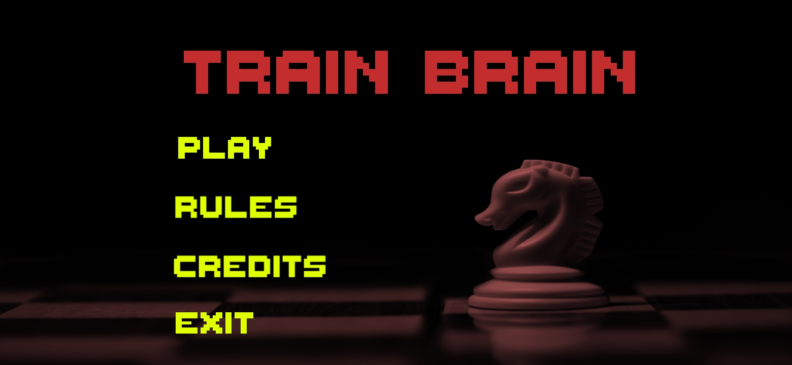

# Train-Brain-Game

Train Brain is a great board game that will improve your strategic and tactical thinking.

This game is very similar to chess and is an excellent board logic game that can boost your brainpower and cognitive thinking.

The game is played on an 8×8 chessboard with two players. Each player starts with 16 pieces: one king, one queen, two rooks, two knights, two bishops, and eight pawns. The pieces have been randomly shuffled on each player's back rank. This will minimize the impact of Theory/Opening in a match. The objective of the game is to capture the enemy king.

 

 

# Train Brain game Features:

* This game is free for all ages, adults, boys, girls, etc..! Absolutely Free…No hidden charges.
* A great exercise for your mind – start boosting your working memory.
* Creates quick Visual attention and memory, increasing your photographic memory.
* Immediately boost your mantle performance, memory, accuracy, and problem-solving skills.
* Keeps your brain young and improves the Short-term as well as Long-term Memory of all ages.
* With the change in movements of a few pieces the game becomes more fun but still competitive.

 

# How to Play:

* The pieces can be moved by dragging them to the desired square.
* Movements of Knights and Bishops have been changed. Knights move 2 squares diagonally and one square horizontally, they can jump over pieces. Whereas bishops move diagonally until 4 squares and can’t jump over pieces.
* The pieces have been randomly shuffled on each player's back rank.
* For castling, the King and Rook may not have moved from their starting squares. All spaces between the king and rook must be empty. The King can castle anytime though in one direction.
* The pawns can be promoted to queen only.
* There are no checks nor there is a checkmate.

 

 

# Game link(Play store)

"https://play.google.com/store/apps/details?id=com.Teknack.TrainBrain"

